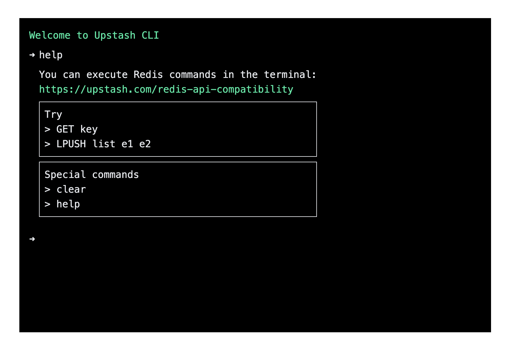

<div align="center">
    <h1 align="center">@upstash/react-cli</h1>
    <h5>CLI for Upstash Redis</h5>
</div>

<div align="center">
  <a href="https://upstash-react-cli.vercel.app/">upstash-react-cli.vercel.app</a>
</div>
<br/>



## 1. Install

```sh-session
$ npm install @upstash/react-cli
```

## 2. Add a client component in your app:

```tsx
// /app/components/cli.tsx

"use client"

import { RedisCli } from "@upstash/react-cli"

import "@upstash/react-cli/dist/index.css"

;<div
  style={{
    width: "100%",
    height: "100%",
    maxWidth: "48rem",
    maxHeight: "32rem",
  }}
>
  <RedisCli url="UPSTASH_REDIS_REST_URL" token="UPSTASH_REDIS_REST_TOKEN" />;
</div>
```

## With Tailwind CSS

If you already have a tailwindcss toolchain, you can omit the css import and add the library to your tailwind config file:

```js
// tailwind.config.js

module.exports = {
  content: [
    // ...
    "./node_modules/@upstash/react-cli/**/*.js", // <--  add this line
  ],
  //...
}
```
